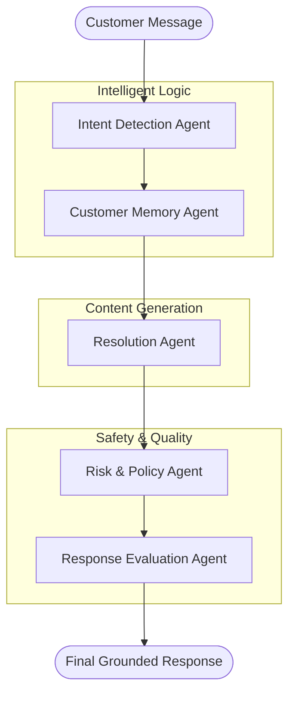

# 🤖 Customer Support AI System

A sophisticated multi-agent system powered by **CrewAI** and **LangChain** that transforms customer support into an intelligent, safe, and automated workflow.

## 🌟 Overview

This project implements a hierarchical multi-agent architecture specifically designed for high-stakes customer service environments. By leveraging specialized agents, the system ensures that every customer message is analyzed for intent, grounded in history, safely drafted, and evaluated for quality before reaching the user.

### 🧠 The Agentic Brain
The system orchestrates **5 specialized AI Agents**:

1.  **🔍 Intent Agent**: Classifies the request (billing, technical, etc.), extracts key entities, and assigns a confidence score.
2.  **🧠 Memory Agent**: Manages long-term customer preferences and session-based context to ensure personalized responses.
3.  **💡 Resolution Agent**: The "Writer" that drafts helpful, factual responses using web search and scraping tools.
4.  **🛡️ Risk & Policy Agent**: The "Guardrail" that scans drafts for hallucinations, policy violations, and safety risks.
5.  **📊 Evaluation Agent**: The "Quality Control" that scores the final output on Correctness, Empathy, and Confidence.

---

## 🏗️ Architecture & Workflow



---

## 🚀 Getting Started

### 📋 Prerequisites
- Python 3.10+
- OpenAI API Key
- (Optional) SerperDev API Key for web search capabilities

### ⚙️ Installation

1. **Clone the repository:**
   ```bash
   git clone https://github.com/Ani-107/crew-ai-project-
   cd crew-ai-project-
   ```

2. **Install dependencies:**
   ```bash
   pip install -r requirements.txt
   ```

3. **Configure Environment:**
   Create a `.env` file in the root directory:
   ```env
   OPENAI_API_KEY=sk-your-key-here
   OPENAI_MODEL_NAME=gpt-4-turbo-preview
   SERPER_API_KEY=your-serper-key-here
   ```

---

## 🛠️ Usage

### Run the Core System
Process a single message through the entire agentic pipeline:
```bash
python customer_support_ai.py
```

### Run Test Scenarios
Execute a suite of pre-defined customer support cases:
```bash
python examples/test_scenarios.py
```

---

## 📊 Technical Capabilities

- **Hierarchical Orchestration**: Managed by a "Manager LLM" to ensure logical task delegation.
- **Tool Integration**: Equipped with `SerperDev` for real-time web research and `ScrapeWebsiteTool` for data extraction.
- **Safety First**: Integrated risk assessment agent prevents common AI failures like hallucinations or policy drifting.
- **Quality Feedback Loop**: Every response is quantitatively scored across three key metrics before final delivery.

---

## 📂 Project Structure

```text
├── customer_support_ai.py   # Main agentic orchestration
├── requirements.txt         # Project dependencies
├── .env.example             # Environment template
├── README.md                # Documentation
└── examples/
    └── test_scenarios.py    # Test suite for various intents
```

---

## 🤝 Contributing

Contributions are welcome! Whether it's adding a new specialized agent, improving safety guardrails, or expanding the toolsets, feel free to open a PR.

---

## 📄 License

This project is licensed under the MIT License - see the LICENSE file for details.

---
Built with ❤️ using [CrewAI](https://crewai.com) and [LangChain](https://langchain.com).
